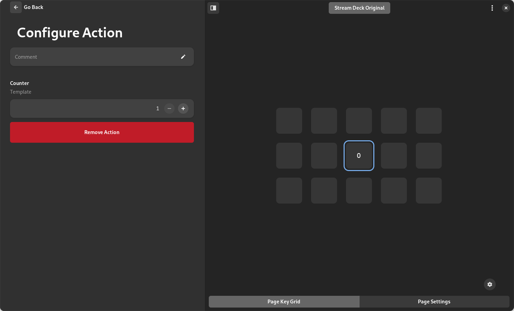

This example will go over how to add a config row to the [Counter action](../AddCounter.md).

We will use the [Adw.SpinRow](https://gnome.pages.gitlab.gnome.org/libadwaita/doc/1-latest/class.SpinRow.html) to control the increment of the counter.

## 1. Setup
!!! warning
    This example is for the [Counter action](../AddCounter.md) without any backends but you can easily adapt it to your needs.

The `counter.py` looks like this:
```python title="counter.py"
# Import StreamController modules
from src.backend.PluginManager.ActionBase import ActionBase
from src.backend.DeckManagement.DeckController import DeckController
from src.backend.PageManagement.Page import Page
from src.backend.PluginManager.PluginBase import PluginBase

class Counter(ActionBase):
    def __init__(self, action_id: str, action_name: str,
                 deck_controller: DeckController, page: Page, coords: str, plugin_base: PluginBase):
        super().__init__(action_id=action_id, action_name=action_name,
            deck_controller=deck_controller, page=page, coords=coords, plugin_base=plugin_base)

        self.counter: int = 0

    def on_ready(self):
        self.set_center_label(str(self.counter))

    def on_key_down(self):
        self.counter += 1
        self.set_center_label(str(self.counter))
```

## 2. Add the row
You can add config rows by overwiding the [`get_config_rows`](../../bases/ActionBase_py.md#get_config_rows) method.
```python title="counter.py" hl_lines="7-11 28-31"
# Import StreamController modules
from src.backend.PluginManager.ActionBase import ActionBase
from src.backend.DeckManagement.DeckController import DeckController
from src.backend.PageManagement.Page import Page
from src.backend.PluginManager.PluginBase import PluginBase

# Import gtk
import gi
gi.require_version("Gtk", "4.0")
gi.require_version("Adw", "1")
from gi.repository import Gtk, Adw #(1)!

class Counter(ActionBase):
    def __init__(self, action_id: str, action_name: str,
                 deck_controller: DeckController, page: Page, coords: str, plugin_base: PluginBase):
        super().__init__(action_id=action_id, action_name=action_name,
            deck_controller=deck_controller, page=page, coords=coords, plugin_base=plugin_base)

        self.counter: int = 0

    def on_ready(self):
        self.set_center_label(str(self.counter))

    def on_key_down(self):
        self.counter += 1
        self.set_center_label(str(self.counter))

    def get_config_rows(self) -> list:
        self.spinner = Adw.SpinRow.new_with_range(1, 100, 1) #(2)!

        return [self.spinner] #(3)
```

1. Import [Gtk](https://www.gtk.org) and [Adw](https://www.gtk.org)
2. Create the [Adw.SpinRow](https://gnome.pages.gitlab.gnome.org/libadwaita/doc/1-latest/class.SpinRow.html)
3. Return the list of rows

## 3. Test appearance of the row
The config area of the action should now look like this:


As you can see the spinner is now visible in the config area, but it looks weird without a proper title.

## 4. Add a title
You can add a title to the [Adw.SpinRow](https://gnome.pages.gitlab.gnome.org/libadwaita/doc/1-latest/class.SpinRow.html) by using the [`set_title`](https://gnome.pages.gitlab.gnome.org/libadwaita/doc/1-latest/method.PreferencesRow.set_title.html) method. It is also recommended to add a subtitle as well by using [`set_subtitle`](https://gnome.pages.gitlab.gnome.org/libadwaita/doc/1-latest/method.ActionRow.set_subtitle.html).

```python title="counter.py" hl_lines="30-31"
# Import StreamController modules
from src.backend.PluginManager.ActionBase import ActionBase
from src.backend.DeckManagement.DeckController import DeckController
from src.backend.PageManagement.Page import Page
from src.backend.PluginManager.PluginBase import PluginBase

# Import gtk
import gi
gi.require_version("Gtk", "4.0")
gi.require_version("Adw", "1")
from gi.repository import Gtk, Adw

class Counter(ActionBase):
    def __init__(self, action_id: str, action_name: str,
                 deck_controller: DeckController, page: Page, coords: str, plugin_base: PluginBase):
        super().__init__(action_id=action_id, action_name=action_name,
            deck_controller=deck_controller, page=page, coords=coords, plugin_base=plugin_base)

        self.counter: int = 0

    def on_ready(self):
        self.set_center_label(str(self.counter))

    def on_key_down(self):
        self.counter += 1
        self.set_center_label(str(self.counter))

    def get_config_rows(self) -> list:
        self.spinner = Adw.SpinRow.new_with_range(1, 100, 1)
        self.spinner.set_title("Increment by")
        self.spinner.set_subtitle("How much to increment the counter by")

        return [self.spinner]
```
The row will now look like this:


## 5. Store the value of the spinner
The spinner is worthless if don't store, restore and use the set value of the counter.

To store the value we have to connect to it's `changed` signal:
```python title="counter.py (partial)" hl_lines="6 10-14"
    def get_config_rows(self) -> list:
        self.spinner = Adw.SpinRow.new_with_range(1, 100, 1)
        self.spinner.set_title("Increment by")
        self.spinner.set_subtitle("How much to increment the counter by")

        self.spinner.connect("changed", self.on_spinner_value_changed) #(1)!

        return [self.spinner]
    
    def on_spinner_value_changed(self, spinner):
        settings = self.get_settings() #(2)
        settings["increment_by"] = int(spinner.get_value()) #(3)
        self.set_settings(settings) #(4)
```

1. Connect the `changed` signal
2. Get the settings via [`get_settings()`](../../bases/ActionBase_py.md#get_settings)
3. Set the value of the spinner
4. Set the new settings via [`set_settings()`](../../bases/ActionBase_py.md#set_settings)

## 6. Restore the value after reload
If you leave the action area and re-enter it, the value will be reset to 1. To change this we have to retrive the stored value and set it to the spinner:
```python title="counter.py (partial)" hl_lines="6 12-14"
def get_config_rows(self) -> list:
    self.spinner = Adw.SpinRow.new_with_range(1, 100, 1)
    self.spinner.set_title("Increment by")
    self.spinner.set_subtitle("How much to increment the counter by")

    self.load_config_values()

    self.spinner.connect("changed", self.on_spinner_value_changed)

    return [self.spinner]

def load_config_values(self):
    settings = self.get_settings()
    self.spinner.set_value(settings.get("increment_by", 1))

def on_spinner_value_changed(self, spinner):
    settings = self.get_settings()
    settings["increment_by"] = int(spinner.get_value())
    self.set_settings(settings)
```
!!! warning
    Always load the settings before connecting any signals. Otherwise the signals will trigger when you set the new value(s).

## 7. Use the value
Now the spinner will be saved on changed and reloaded if necessary, but we are not doing anything with the value, yet. Let's change that:
```python title="counter.py (partial)" hl_lines="2-3"
def on_key_down(self):
    settings = self.get_settings()
    self.counter += int(settings.get("increment_by", 1))
    self.set_center_label(str(self.counter))
```
!!! warning
    It is **not** possible to use `self.spinner.get_value()` instead of `self.get_settings()` because the spinner will only exist in memory if the configurator has been loaded for the action.

## 8. The result
The full `counter.py` looks like this:
```python title="counter.py"
# Import StreamController modules
from src.backend.PluginManager.ActionBase import ActionBase
from src.backend.DeckManagement.DeckController import DeckController
from src.backend.PageManagement.Page import Page
from src.backend.PluginManager.PluginBase import PluginBase

# Import gtk
import gi
gi.require_version("Gtk", "4.0")
gi.require_version("Adw", "1")
from gi.repository import Gtk, Adw

class Counter(ActionBase):
    def __init__(self, action_id: str, action_name: str,
                 deck_controller: DeckController, page: Page, coords: str, plugin_base: PluginBase):
        super().__init__(action_id=action_id, action_name=action_name,
            deck_controller=deck_controller, page=page, coords=coords, plugin_base=plugin_base)

        self.counter: int = 0

    def on_ready(self):
        self.set_center_label(str(self.counter))

    def on_key_down(self):
        settings = self.get_settings()
        self.counter += settings.get("increment_by", 1)
        self.set_center_label(str(self.counter))

    def get_config_rows(self) -> list:
        self.spinner = Adw.SpinRow.new_with_range(1, 100, 1)
        self.spinner.set_title("Increment by")
        self.spinner.set_subtitle("How much to increment the counter by")

        self.load_config_values()

        self.spinner.connect("changed", self.on_spinner_value_changed)

        return [self.spinner]
    
    def load_config_values(self):
        settings = self.get_settings()
        self.spinner.set_value(settings.get("increment_by", 1))
    
    def on_spinner_value_changed(self, spinner):
        settings = self.get_settings()
        settings["increment_by"] = int(spinner.get_value())
        self.set_settings(settings)
```